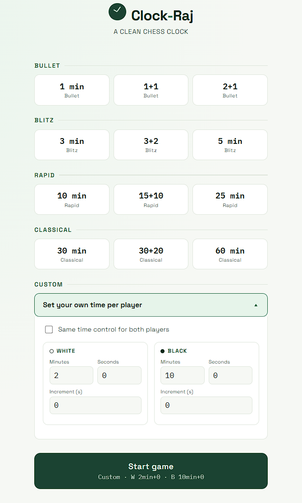
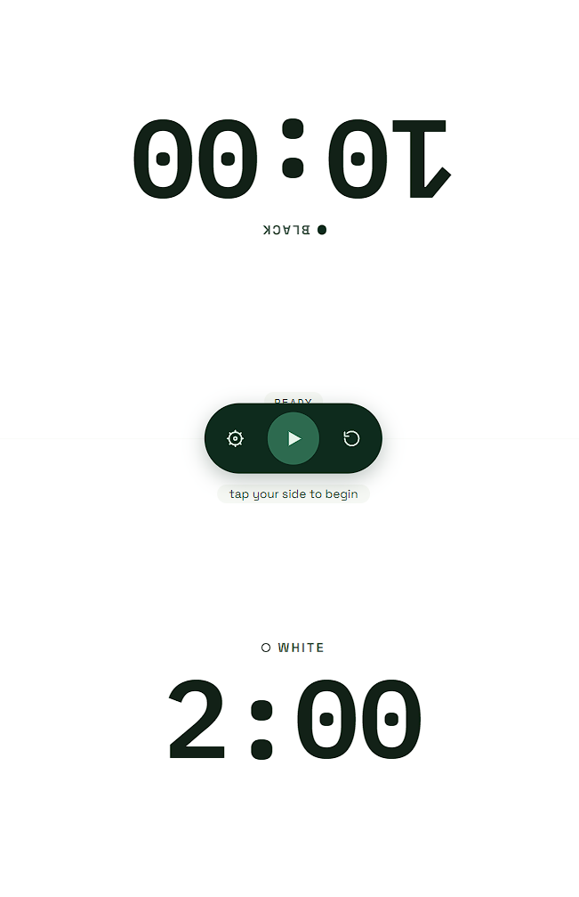

# Clock-Raj ♟️

A clean, responsive chess clock built with **HTML, CSS, and vanilla JavaScript**.

Clock-Raj provides a simple interface for playing timed chess games with preset time controls or fully customizable clocks for White and Black.

## 📸 Screenshots

Add screenshots of the project here.

### Setup Screen



### Chess Clock

Then add it below:



---

## ✨ Features

- Clean and modern chess-clock interface
- Responsive design for desktop and mobile screens
- Preset time controls:
  - **Bullet:** 1+0, 1+1, 2+1
  - **Blitz:** 3+0, 3+2, 5+0
  - **Rapid:** 10+0, 15+10, 25+0
  - **Classical:** 30+0, 30+20, 60+0
- Custom time controls
- Separate White and Black clock settings
- Optional same-time setting for both players
- Increment support
- Pause and resume
- Reset / new game
- Time-up detection
- Active-player highlighting
- Low-time warning
- Critical-time animation
- Mobile-friendly touch interface
- No external JavaScript libraries required

## 🎮 How It Works

1. Open the application.
2. Select a preset time control or open **Custom**.
3. For custom games, configure the time and increment for White and Black.
4. Click **Start game**.
5. Tap your side when you finish your move.
6. The opponent's clock starts automatically.
7. The increment is added to the player who just completed their move.
8. If a player's clock reaches zero, the game ends and their side is marked as out of time.

## ⏱️ Time Controls

Clock-Raj includes four categories of predefined chess time controls.

| Category | Available Controls |
|---|---|
| Bullet | 1+0, 1+1, 2+1 |
| Blitz | 3+0, 3+2, 5+0 |
| Rapid | 10+0, 15+10, 25+0 |
| Classical | 30+0, 30+20, 60+0 |

The format `5+0` means **5 minutes with 0 seconds increment**, while `3+2` means **3 minutes with a 2-second increment after each move**.

## 🛠️ Custom Time Control

The Custom section allows you to configure:

- Minutes
- Seconds
- Increment
- Different clocks for White and Black

By default, **"Same time control for both players"** is enabled. You can disable it when you want different settings for each player.

## 🎨 Design

The interface uses a minimal chess-inspired visual design with:

- Green-based color palette
- Large digital clock display
- Rounded controls and cards
- Responsive layouts
- Space Grotesk for interface text
- IBM Plex Mono for clock/timer numbers

The project also includes a mobile breakpoint for smaller screens.

## 💻 Technologies Used

- **HTML5** — application structure
- **CSS3** — layout, responsive design, animations, and visual styling
- **JavaScript (ES6+)** — timer logic, controls, presets, and game state
- **Google Fonts** — Space Grotesk and IBM Plex Mono
- **requestAnimationFrame()** — smooth and continuously updated countdown

## 📁 Project Structure

A simple version of the project can be organized like this:

```text
Clock-Raj/
│
├── index.html
├── style.css
├── script.js
├── README.md
└── screenshots/
    ├── setup-screen.png
    └── chess-clock.png
```

The current application is contained in a **single HTML file**, including its HTML structure, CSS, and JavaScript.

## 🚀 Running the Project

No build tools or installation are required.

link: 

## 🧠 JavaScript Logic

The application keeps track of each player's:

- Remaining milliseconds
- Increment
- Active state
- Running/paused state
- Game-start state
- Flagged/time-up state

The countdown is handled using `requestAnimationFrame()`. When a player presses their side, the application switches the active clock to the opponent. The increment is added to the player who completed the move.

When a player's remaining time reaches zero, the application stops the game and displays **GAME OVER**.

## 📱 Responsive Design

Clock-Raj is designed to work across different screen sizes.

On smaller screens, the preset grid automatically changes from three columns to two columns, making the setup interface easier to use on mobile devices.

## 🔮 Future Improvements

Possible improvements for future versions:

- Chess move counter
- Sound effects
- Custom themes
- Dark mode
- Keyboard controls
- Fullscreen mode
- Move history
- Game statistics
- Different increment/delay modes
- Chessboard integration
- Local game history using `localStorage`
- PWA support for offline installation
- Online multiplayer support

## 📄 License

This project is available for personal and educational use. You can modify and extend it for your own projects.

---

## 👨‍💻 Project

**Clock-Raj** — A clean chess clock for timed chess games.

Built with ❤️ using HTML, CSS, and JavaScript.
